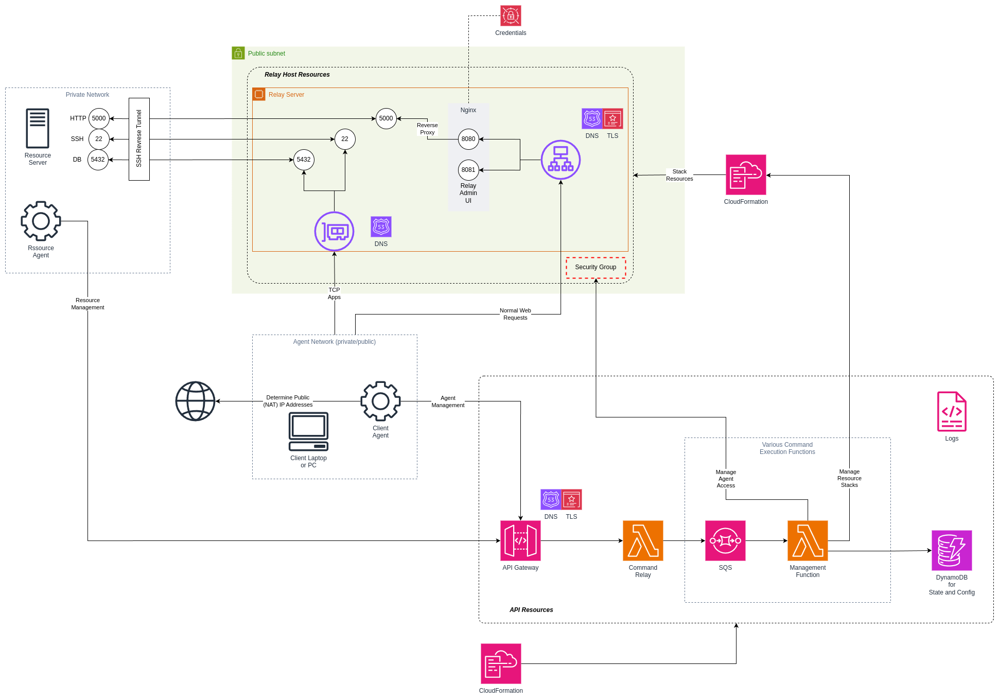

# Home Tunnel via Cloud Service Provider (cumulus-tunnel)

Creating a custom solution similar to [NGrok](https://ngrok.com/our-product/secure-tunnels) tunneling using a Public Cloud like AWS.

> [!IMPORTANT]  
> This is a personal project to solve a specific challenge. I do not offer any guarantees in terms of security or costs. Use at your own risk.

# What problem is this solving

> I have a private system not directly exposed to the internet and I want to expose at least some services to the Internet in a controlled and restricted way. This is similar to the `ngrok` tunneling solution. Why I don't use `ngrok` or other solutions is that the free options was too limiting and switching to a subscription would be too expensive and still leave me with some lacking features.

# Project Status

| Date       | Status           | Notes                                                                    |
|------------|:----------------:|--------------------------------------------------------------------------|
| 2024-12-24 | Major Refactor   | After some practical tests, first major refactor done. Still lots to do. |
|            |                  | Updated integration diagram                                              |
|            |                  | Reorganized features and progress                                        |
| 2024-12-17 | Work in Progress | Most of the AWS IaC is done. Busy with the tunnel service                |
| 2024-12-07 | Planning         | Initial planning and setup of the project                                |

# Planned features

* [X] Relay Server Agent
  * [ ] Python Package
  * [ ] Relay Server Admin UI (Web)
* [X] Client Agent
  * [ ] Python Package
  * [ ] Client Local Admin UI (Web)
* [X] Deployment Script
* [ ] API Commands
  * [X] Register Relay Server
  * [X] Deregister Relay Server
  * [X] Get Relay Server Config and Status
  * [ ] Register Agent
  * [ ] Deregister Agent
  * [ ] Get overall status
* [ ] AMI Image Builder Solution to Prepare AMI Images and set a SSM Parameter

The initial solution will be based on AWS but I will keep options open to potential roll it out to various other Cloud Service Providers that have the following features available for this solution:

* Virtual Machine instance to start the relay server
  * Failure tolerant - meaning a terminated instance will automatically restart
  * Pipeline to build new patched images on a regular bases
* DNS management capabilities (add/remove/edit records)
* Simple storage solution to act as a repository for some temporary data as needed

# Cost

> [!NOTE]
> These cost estimates is based on a previous design which is no longer used. This will be updated again at a later stage.

For AWS the expected monthly cost breakdown is in the file [aws_cost_estimate.json](./aws_cost_estimate.json) and comes down to:

* Less than USD12 per month

The price is less than the cheapest `ngrok` option above free-tier (around USD18 on 2024-12-07).

> [!CAUTION]
> These are cost estimates and many factors may influence the final cost. Use the [AWS Pricing Calculator](https://calculator.aws/#/) to adjust the numbers to your own needs.

# Documentation

Still limited, but you can start to look at the [development notes](./DEV_NOTES.md) that will be updated as progress is made until proper documentation can be created.

